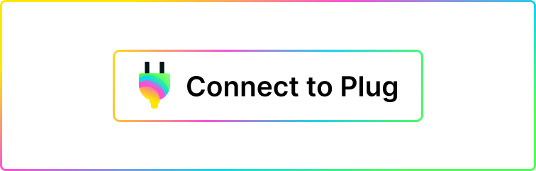

# Plug Connnect

The Plug Connect button is a basic React Component button you can use to integrate Plug's Agent features for authenticating a user's identity and requesting access to the Plug Agent to sign requests to your canisters on behalf of that identity.

## 🤔 Installation

The [Plug Connect](https://github.com/Psychedelic/plug-connect/packages/919824) package is in the [Github Package Registry](https://docs.github.com/en/packages/working-with-a-github-packages-registry/working-with-the-npm-registry) and not in the [NPM Registry](https://www.npmjs.com/)!

This is important to note as we keep our projects under the [@Psychedelic organisation](https://github.com/psychedelic) on Github, our official channel for our projects.

```
yarn add @psychedelic/plug-connect
```

To pull and install the Plug Connect package from [@Psychedelic](https://github.com/psychedelic) via the NPM CLI, you'll need:

- A personal access token (you can create a personal acess token [here](https://github.com/settings/tokens))
- The personal access token with the correct scopes, **repo** and **read:packages** to be granted access to the [GitHub Package Registry](https://docs.github.com/en/packages/working-with-a-github-packages-registry/working-with-the-npm-registry#authenticating-to-github-packages).

- Authentication via `npm login`, using your Github email for the **username** and the **personal access token** as your **password**:

Once you have those ready, run:

```
npm login --registry=https://npm.pkg.github.com --scope=@Psychedelic
```

> **Note:** You only need to configure this once to install the package!
    On npm login provide your Github email as your username and the Personal access token as the password.

You can also setup your npm global settings to fetch from the Github registry everytime it finds a **@Psychdelic** package, find the instructions [here](https://docs.npmjs.com/configuring-your-registry-settings-as-an-npm-enterprise-user).

## 🎁 Use

Start by setting your project to fetch **@Psychdelic** packages from the correct registry, if you haven't [setup](https://docs.npmjs.com/configuring-your-registry-settings-as-an-npm-enterprise-user) your npm globals to do this automatically you need an `npmrc` file.

Create the `.npmrc` in the root of your project by:

```sh
touch .npmrc
```

Open the file and put the following content:

```sh
@psychedelic:registry=https://npm.pkg.github.com
```

You can now import the PlugConnect package:

```js
import PlugConnect from '@psychedelic/plug-connect';
```

Use the component:

```js
<PlugConnect
  whitelist={['canisterid-1', 'canisterid-2']}
  onConnectCallback={() => console.log("Some callback")}
/>
```

The props `dark`, `host` and `title` are also supported:

```js
<PlugConnect
  dark
  title="My title"
  host="host-example"
  whitelist={['canisterid-1', 'canisterid-2']}
  onConnectCallback={() => console.log("Some callback")}
/>
```

> **Note:** `host` defaults to `https://mainnet.dfinity.network` and `whitelist` defaults to an empty list

Use the storybook as a playground to learn more!

## ⚡ Development

You'll need to have `nodejs` installed, NPM or [YARN](https://yarnpkg.com/) which is the preferred package manager throught this document, feel free to use [NPM](https://www.npmjs.com/) by changing the commands in accordance.

Pull the repository to your local and install the dependencies by:

```zsh
yarn install
```

To start the development server:

```sh
yarn start
```

This builds to `/dist` and runs the project in watch mode so any edits you save inside `src` causes a rebuild to `/dist`.

## 📚 Storybook

Then Storybook:

```bash
yarn storybook
```

This loads the stories from `./stories`.

## Contributing

Create branches from the `main` branch and name it in accordance to the [conventions](https://www.conventionalcommits.org/en/v1.0.0/) below - look for the types listed below.

```
💍 test: Adding missing tests
🎸 feat: A new feature
🐛 fix: A bug fix
🤖 chore: Build process or auxiliary tool changes
✏️ docs: Documentation only changes
💡 refactor: A code change that neither fixes a bug or adds a feature
💄 style: Markup, white-space, formatting, missing semi-colons...
```

For example,

```
git checkout main

git checkout -b test/a-test-scenario

git commit -m 'test: verified X equals Z when Foobar'

git commit -m 'refactor: input value changes'
```

Once complete, push to origin and create a new PR -> main, use the naming convention above, such as for a new PR named `test: some scenario` or `fix: scenario amend X`.

When approved, make sure you have `rebased` to latest and fix any issues and don't merge any conflicts or cause any regressions.

To finish, you'll Squash and merge!

## Repo

[TSDX](https://tsdx.io/) - Zero-config CLI for TypeScript used by this repo. 
